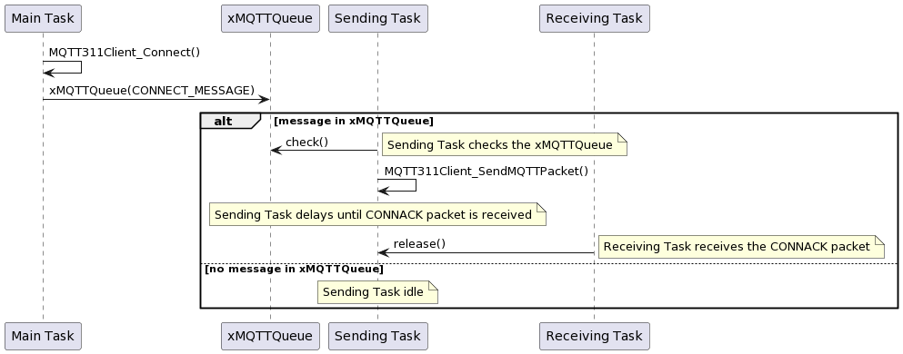
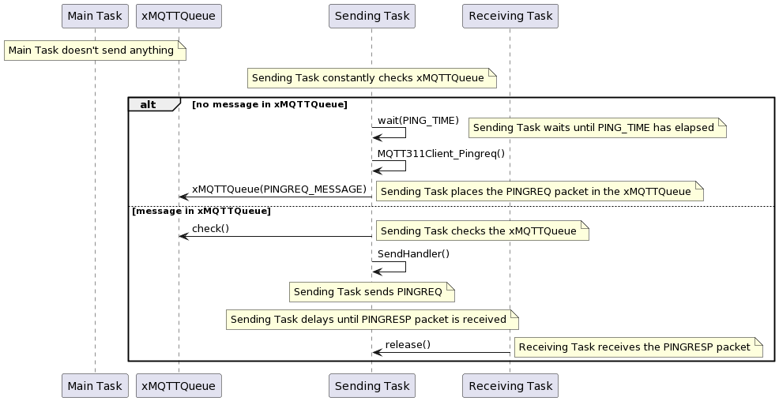

# MQTT311-Client-Library

This repository contains a small embedded library called `mqtt311-client-library` for MQTT 3.1.1 clients, which fully supports all functionalities from the MQTT 3.1.1 standard. You can find the standard documentation at https://docs.oasis-open.org/mqtt/mqtt/v3.1.1/os/mqtt-v3.1.1-os.html.

This library can work on any microcontroller or system that has an internet connection and can open a TCP or TLS socket.

# Features

- Fully supports all MQTT 3.1.1 packet types (CONNECT, PUBLISH, etc.).
- Provides a number of external functions to set in order to connect to the MQTT broker, send, and receive data.
- Incorporates FreeRTOS to have separate send and receive tasks.
- Uses queues to send messages so nothing is ever blocked.

# FreeRTOS Incorporation

The main part of the library which incorporates FreeRTOS in order to maintain and manage other components (mainly MQTT 3.1.1 packets) is the `MQTT311Client_Driver` component which utilizes two main tasks of the system - Sending Task and Receiving Task. 

The sending task and receiving task are responsible for two key properties of the library, sending of the MQTT 3.1.1 packets to the MQTT broker and receiving MQTT 3.1.1 packets from the same MQTT broker.

In order to accomplish this, the tasks are using two FreeRTOS objects - A Queue and a Semaphore. These objects are used for synchronization purposes and serve to drive tasks as well as block them. The FreeRTOS queue is used to store MQTT 3.1.1 message packets and send them when there is time to do so. It also blocks the sending task until there is something to send. The semaphore is used to synchronize the beginning of the two tasks by blocking one until the other one has completed its run or has nothing to do. This makes the tasks run concurrently but one after the other so nothing is ever clogged and messages can always be received and sent since the two tasks have the same priority and the reception will always be checked after the sending task has gone through one cycle of checking the queue and sending a message if necessary.

## Examples

The following two examples attempt to demonstrate the mechanisms behind the FreeRTOS utilization of the MQTT 3.1.1 client library.

### CONNECT Message Example

The figure below provides a sequence diagram demonstrating a scenario in which the client tries to connect to the MQTT broker by using the MQTT 3.1.1 client library and the CONNECT message. There are three tasks involved in the process - main task which represents the application, the sending task and the receiving task. The application (main task) attempts to establish a connection to the MQTT broker by calling the `MQTT311Client_Connect()` function. This function as demonstrated in the earlier sections, fills all the necessary data and places the `CONNECT_MESSAGE` structure in a queue for the sending task to receive. The sending task checks the queue, sees that it has a message to send, and calls the appropriate message handler for that packet type. The sending task is delayed until the message is responded to if such is the case that it expects a response. In the case of the CONNECT message it does, since it expects the `CONNACK` message in return. Sending task being delayed means that the receiving task can uninterruptedly check for new bytes received and once the `CONNACK` message had been identified and received, releases the sending task and allows for the process of connection establishment to end.



### PINGREQ Message Example

The figure below provides a sequence diagram demonstrating a highly likely scenario. In this scenario, the application is not doing anything to send packets to the MQTT broker. This could cause the system to disconnect as the alive flags were set to some non-infinite value during the connection establishment phase. For these purposes, it can be seen on the diagram, the sending packet measures time since it last sent a packet and if that time exceeds a predefined value, the `PINGREQ` packet gets sent automatically by the sending task and it is delayed until the receive task gets a `PINGRESP` packet back from the MQTT broker as a response.



# Flexibility and Extendibility

While designing the MQTT 3.1.1 client library, special care was taken so that the library is easy to use and easy to incorporate into multiple architectures. This means that it is designed with decoupling in mind, in such a way that only the MQTT fundamentals are implemented and there is no dependency on any other library or mechanism other than the FreeRTOS library described in the previous section. The only requirement is for a device to have an internet connection and the ability to open TCP and/or SSL sockets in order to establish a connection to the MQTT brokers either via port number 1883 (TCP) or 8883 (TLS).

For these reasons, the users of the library are left with the ability to choose their own functions which play crucial roles throughout the system and they can choose to make those functions be more or less secure, resource heavy or time consuming by implementing their own solutions or using one of the many available ones.

### MQTT311Client_Utilities

`MQTT311Client_Utilities` is a component of the MQTT 3.1.1 client library which provides many helpful utility functions for the system to re-use but also provides various functions which require (some of them are optional and don't have to be implemented) external implementation. These functions vary depending on the system for which they are used and this makes the library highly re-usable because of its no-dependency postulate. The functions which are left for external implementation are:

1. **Connect Socket:** This function serves to establish a network connection between the client and broker by opening a socket over which the communication will be held. This socket can be a TCP socket or an SSL socket and the function need only be assigned without further configuration other than the specification of the broker domain name and a port number (valid certificate must be given in the SSL case).
2. **Close Socket:** This function serves to close the socket at the end of the communication.
3. **Send Data to Socket:** This function serves to send bytes to the socket, which will transfer it over to the broker over the cond protocol.
4. **Read From Socket:** This function servers to read data from the socket into a buffer.
5. **Print:** This is a debug function which serves to print debug messages in a way that the user finds convenient.
6. **Process Buffer Data:** This function can handle buffer processing after the bytes have been received from the socket. This function is the main key link between the components which use the MQTT data in some form.

An example of the library configuration to use external implementations of the functions is:

```c
MQTT311Client_SetConnectSocket(tcp_connect_socket);
MQTT311Client_SetSendToSocket(tcp_send_data);
MQTT311Client_SetReadFromSocket(tcp_receive_data);
MQTT311Client_SetPrint(debug_print);
MQTT311Client_SetProcessBufferData(mqtt_process_buffer_data);
```

Besides the external function setting features, the library also provides for an ability to configure some inside parameters which modify the system to the user's specifications. These parameters include:

1. **Redelivery Attempts**: Defines how many times to redeliver the message before announcing failed delivery.
2. **Pinging Time**: Defines the maximum time between two sending packets to occur before the sending task automatically sends the PINGREQ packet to keep the connection alive.
3. **Sending Task Delay**: Represents a value in miliseconds which defines how much time will the sending task be delayed.
4. **Receiving Task Delay**: Represents a value in miliseconds which defines how much time will the receiving task be delayed.

With this, the system can be fine-tuned to operate on any optimization level since the tasks can be set to check for messages sporadically or at a very fast pace.

# Usage

There are two complete examples on how to use this library to connect to an MQTT broker (test.moqsuitto.org).

## TCP Connection

For example usage with TCP socket, check out the [ESP32 TCP example](/examples/esp32/tcp/)

## SSL Connection

For example usage with SSL socket, check out the [ESP32 SSL example](/examples/esp32/ssl/)
