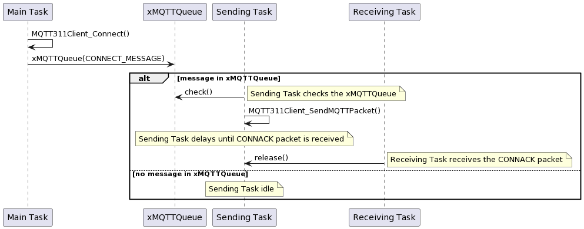
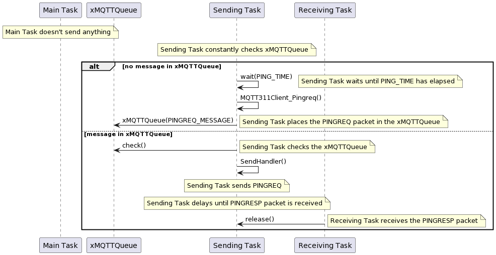

# FreeRTOS Incorporation

The main part of the library which incorporates FreeRTOS in order to maintain and manage other components (mainly MQTT 3.1.1 packets) is the `MQTT311Client_Driver` component which utilizes two main tasks of the system - Sending Task and Receiving Task. 

The sending task and receiving task are responsible for two key properties of the library, sending of the MQTT 3.1.1 packets to the MQTT broker and receiving MQTT 3.1.1 packets from the same MQTT broker.

In order to accomplish this, the tasks are using two FreeRTOS objects - A Queue and a Semaphore. These objects are used for synchronization purposes and serve to drive tasks as well as block them. The FreeRTOS queue is used to store MQTT 3.1.1 message packets and send them when there is time to do so. It also blocks the sending task until there is something to send. The semaphore is used to synchronize the beginning of the two tasks by blocking one until the other one has completed its run or has nothing to do. This makes the tasks run concurrently but one after the other so nothing is ever clogged and messages can always be received and sent since the two tasks have the same priority and the reception will always be checked after the sending task has gone through one cycle of checking the queue and sending a message if necessary.

## Examples

The following two examples attempt to demonstrate the mechanisms behind the FreeRTOS utilization of the MQTT 3.1.1 client library.

### CONNECT Message Example

The figure below provides a sequence diagram demonstrating a scenario in which the client tries to connect to the MQTT broker by using the MQTT 3.1.1 client library and the CONNECT message. There are three tasks involved in the process - main task which represents the application, the sending task and the receiving task. The application (main task) attempts to establish a connection to the MQTT broker by calling the `MQTT311Client_Connect()` function. This function as demonstrated in the earlier sections, fills all the necessary data and places the `CONNECT_MESSAGE` structure in a queue for the sending task to receive. The sending task checks the queue, sees that it has a message to send, and calls the appropriate message handler for that packet type. The sending task is delayed until the message is responded to if such is the case that it expects a response. In the case of the CONNECT message it does, since it expects the `CONNACK` message in return. Sending task being delayed means that the receiving task can uninterruptedly check for new bytes received and once the `CONNACK` message had been identified and received, releases the sending task and allows for the process of connection establishment to end.

### PINGREQ Message Example

The figure below provides a sequence diagram demonstrating a highly likely scenario. In this scenario, the application is not doing anything to send packets to the MQTT broker. This could cause the system to disconnect as the alive flags were set to some non-infinite value during the connection establishment phase. For these purposes, it can be seen on the diagram, the sending packet measures time since it last sent a packet and if that time exceeds a predefined value, the `PINGREQ` packet gets sent automatically by the sending task and it is delayed until the receive task gets a `PINGRESP` packet back from the MQTT broker as a response.

